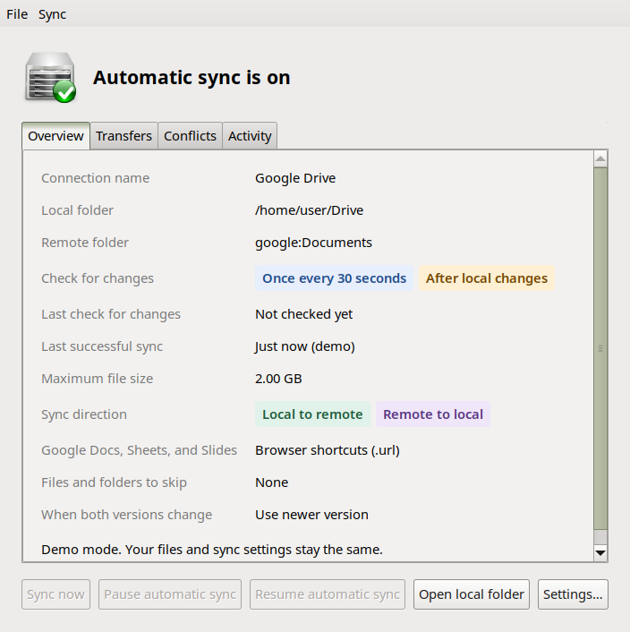

# Drive Synchronization Daemon Manager

This is a GTK desktop application for syncing a local folder with remote
storage through `rclone`.



Requires Linux with systemd, Python 3.10+, GTK 3, and rclone 1.66+.
The desktop app requires X11 or XWayland. No pip dependencies are needed.

Run from source:
```
make run
```
Install for the current user:
```
make install-user
~/.local/bin/drive-synchronization-daemon-manager
```
Build and install a Debian package system-wide:
```
make deb
sudo apt install ./dist/drive-synchronization-daemon-manager_0.2.0_all.deb
```
The Debian package installs dependencies through apt. Run the app as your
normal user. Each user keeps their own accounts, settings, and sync services.
When switching installations, open the desired app and apply its settings.

Connect an account, choose a remote folder and an empty local folder, then
create the connection. Wait for the first sync to finish before editing files.
Closing the app leaves background sync running while the user session exists.

Sync works in both directions, including deletions. Keep separate backups.
Settings and credentials are stored under ~/.config; sync state and recovery
files are stored under ~/.local. XDG directory overrides are supported.

Run tests:
```
make test
make deb
python3 tests/package_smoke.py
```
